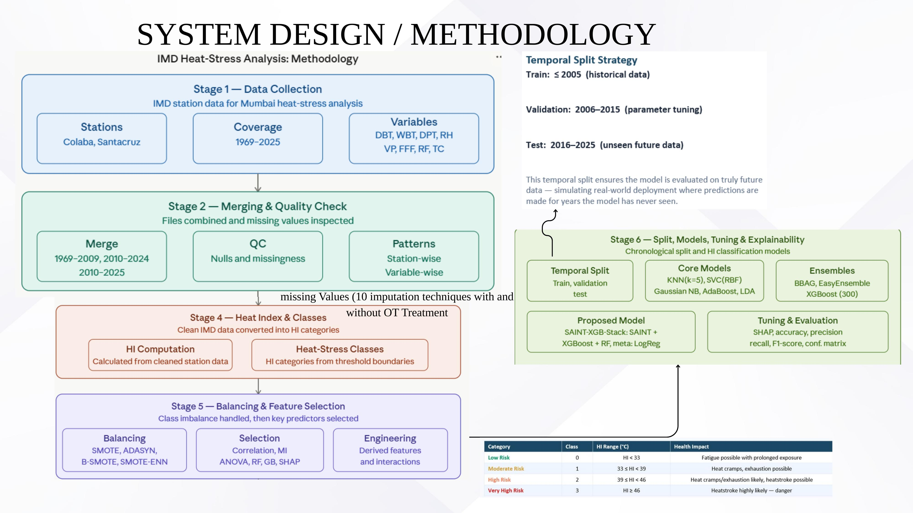
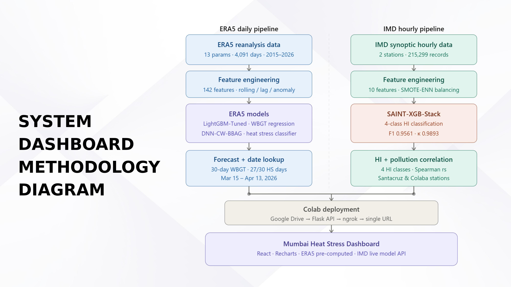
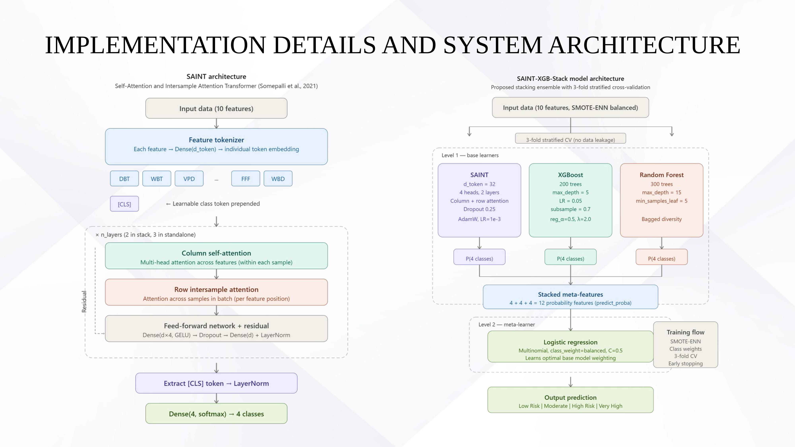
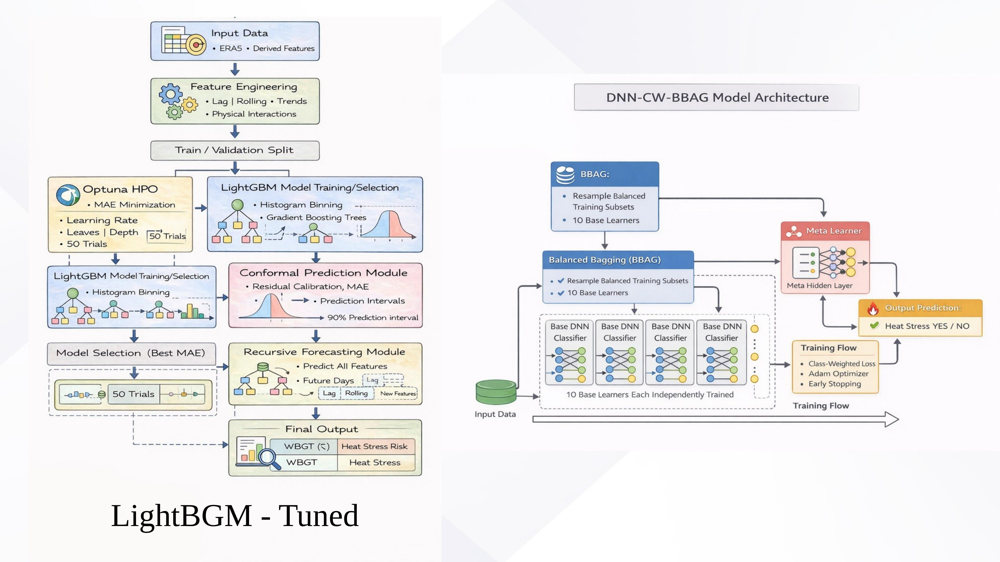
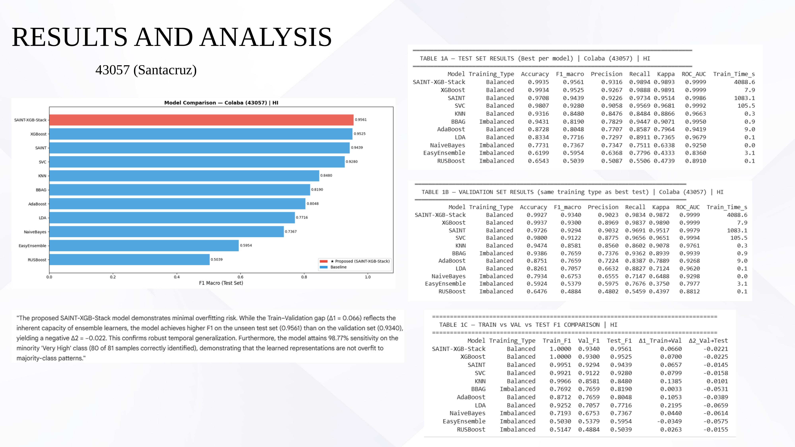
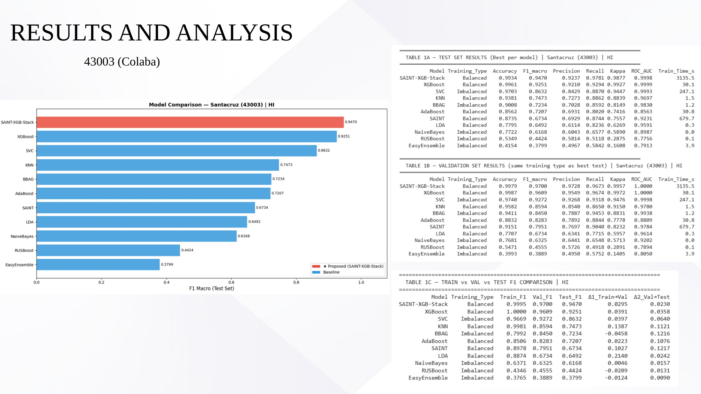
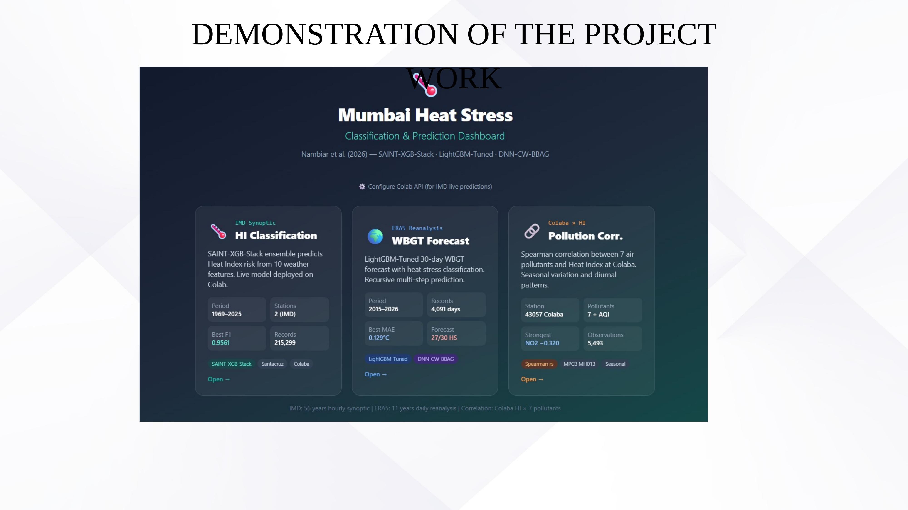
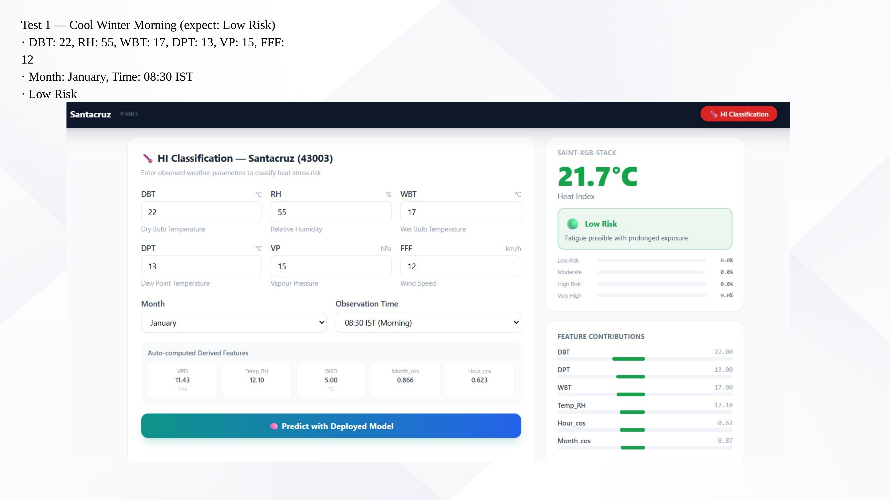
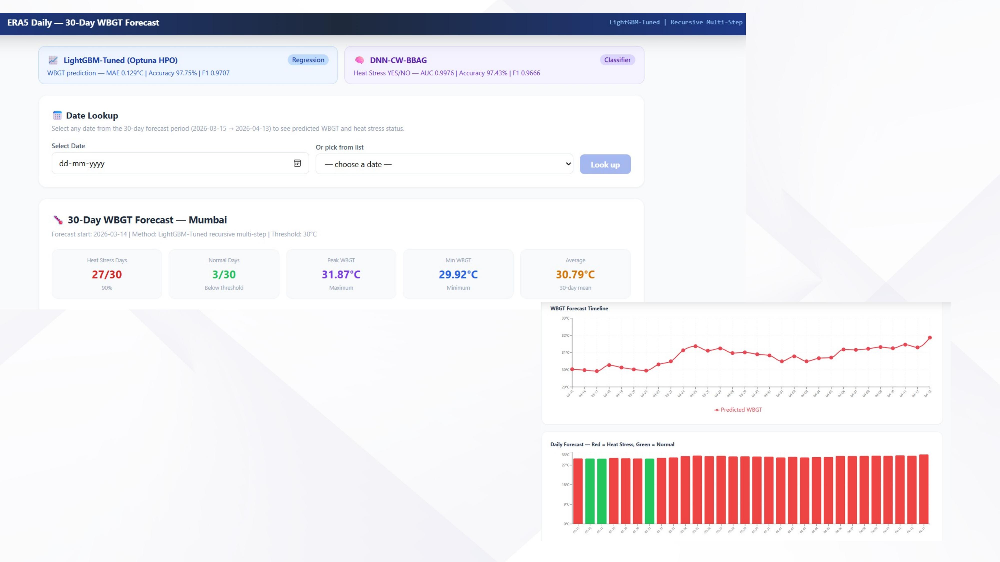

# 🌡️ Mumbai Heat Stress Prediction & Classification System

**A hybrid Machine Learning + Deep Learning system for classifying Heat Index risk and forecasting WBGT-based heat stress in Mumbai, built on 56 years of IMD synoptic data and 11 years of ERA5 reanalysis data.**


---

## 📖 Table of Contents

- [Overview](#-overview)
- [Team](#-team)
- [Problem Statement](#-problem-statement)
- [Objectives](#-objectives)
- [Key Features](#-key-features)
- [System Architecture & Methodology](#-system-architecture--methodology)
- [Datasets](#-datasets)
- [Heat Index / WBGT Formulas](#-heat-index--wbgt-formulas)
- [Model Architecture](#-model-architecture)
- [Tech Stack](#-tech-stack)
- [Results](#-results)
- [Dashboard / Demo](#-dashboard--demo)
- [Challenges & Solutions](#-challenges--solutions)
- [Suggested Repository Structure](#-suggested-repository-structure)
- [Getting Started](#-getting-started)
- [Publications](#-publications)
- [Acknowledgements](#-acknowledgements)
- [License](#-license)

---

## 📖 Overview

Rapid urbanization and climate change have driven a sharp rise in heat stress across cities like Mumbai. Temperature alone is not enough to assess human discomfort — the **Heat Index (HI)** combines temperature and humidity to represent perceived heat, while the **Wet Bulb Globe Temperature (WBGT)** additionally factors in wind and solar radiation. High values of either metric are linked to serious health risks including heat exhaustion, heat stroke, and cardiovascular strain.

Most existing approaches focus only on temperature forecasting or historical trend analysis — they don't classify **human risk levels**. This project builds a **data-driven predictive system** that:

- Classifies Heat Index into **risk categories** (Low, Moderate, High, Very High) from IMD station data
- Forecasts **WBGT** 30 days ahead from ERA5 reanalysis data
- Correlates heat stress with **air pollution**
- Serves all three through a live, deployed **web dashboard**

The project combines traditional ML (LightGBM, XGBoost, CatBoost), deep learning (TabNet, N-HiTS, PatchTST, iTransformer, TFT, DNN-CW-BBAG), and a novel **hybrid stacking ensemble (SAINT + XGBoost + Random Forest)** to handle severe class imbalance in rare, extreme heat events.

---

## 👥 Team

**Batch B — Group No. 12**
Department of Information Technology, Xavier Institute of Engineering

| Name | Roll No. |
|---|---|
| Licia Almeida | 02 |
| Janaki Bal | 04 |
| Shravani Jadhav | 18 |
| Priyadarshini Sandilyan | 34 |

**Guided by:** Prof. Sulochna Ma'am (Prof. Jaya Jeswani co-authors the associated publications)

---

## 🎯 Problem Statement

Urban regions like Mumbai face increasing heat stress, impacting public health and safety. Traditional approaches focus on temperature or HI computation but lack **predictive classification of risk levels**. Real-world meteorological data adds further challenges:

- Severe class imbalance (rare but critical "Very High" events)
- Missing and noisy data
- Complex, non-linear relationships between variables
- Existing models often rely on plain accuracy, which is misleading on imbalanced data

There is a need for a robust, data-driven system that can accurately classify Heat Index into risk categories, effectively detect rare extreme heat events, and generalize well to unseen future data.

## 🎯 Objectives

- Develop a data-driven system to classify Heat Index (HI) into risk categories (**Low, Moderate, High, Very High**)
- Analyze and compare heat stress patterns across the **inland (Santacruz)** and **coastal (Colaba)** regions
- Process long-term IMD synoptic data through merging, cleaning, and imputation
- Compute Heat Index and generate reliable class labels
- Address class imbalance using advanced techniques such as **SMOTE-ENN**
- Design and compare multiple models, and propose a **hybrid stacking model (SAINT + XGBoost + RF)**
- Achieve strong performance in detecting rare extreme heat events (Very High class) using **F1 macro**
- Develop, evaluate, and compare ML/DL architectures for predicting heat stress using **ERA5** reanalysis data and **WBGT**

---

## ✨ Key Features

- 🔴🟡🟢 **4-class HI risk classification** (Low / Moderate / High / Very High) from live weather inputs
- 📈 **30-day WBGT forecasting** via recursive multi-step prediction (LightGBM-Tuned, Optuna-optimized)
- 🧠 **Hybrid stacking ensemble** (SAINT + XGBoost + Random Forest) purpose-built for imbalanced, rare-event detection
- 🫁 **Heat Index ↔ air pollution correlation** analysis (Spearman rs across 7+ pollutants)
- ⚖️ **Class imbalance handling** via SMOTE, ADASYN, Borderline-SMOTE, and SMOTE-ENN
- 🔍 **Explainability** via SHAP values and PCMCI causal discovery
- 📊 **Uncertainty quantification** via conformal prediction intervals
- 🕰️ **Temporal (chronological) train/validation/test split** to simulate true future forecasting, avoiding data leakage
- 🖥️ **Live web dashboard** (React + Flask API) with date lookup, feature-contribution breakdowns, and forecast visualizations

---

## 🧭 System Architecture & Methodology

### End-to-end methodology (IMD pipeline)

The IMD pipeline runs through six stages — data collection, merging & quality checks, missing-value imputation, Heat Index & class computation, class balancing & feature selection, and finally a chronological split into model training, tuning, and explainability.



**HI risk category thresholds:**

| Category | Class | HI Range (°C) | Health Impact |
|---|---|---|---|
| Low Risk | 0 | HI < 33 | Fatigue possible with prolonged exposure |
| Moderate Risk | 1 | 33 ≤ HI < 39 | Heat cramps, exhaustion possible |
| High Risk | 2 | 39 ≤ HI < 46 | Heat cramps/exhaustion likely, heatstroke possible |
| Very High Risk | 3 | HI ≥ 46 | Heatstroke highly likely — danger |

**Temporal split strategy** (chronological, no leakage):
- **Train:** ≤ 2005 (historical data)
- **Validation:** 2006–2015 (parameter tuning)
- **Test:** 2016–2025 (unseen future data)
### End-to-end methodology (ERA5 pipeline)

The ERA5 pipeline runs through twelve stages — data ingestion & unit correction, feature engineering (70+ features), exploratory data analysis, a temporal split with 5-fold time-series cross-validation, three parallel modeling tracks (classical ML, DL time-series, and a DNN CW-BBAG classifier), Optuna hyperparameter optimization with conformal prediction intervals, comprehensive model evaluation, a 30-day future WBGT forecast, a 6-layer forecast validation/calibration stage, saved results, and a final summary of findings.


### Full system pipeline (ERA5 + IMD → dashboard)

Two parallel pipelines — a daily ERA5 pipeline (WBGT regression + heat-stress classification) and an hourly IMD pipeline (HI risk classification + pollution correlation) — converge into a single Colab-deployed Flask API behind ngrok, serving a React dashboard.



---

## 🗄️ Datasets

### 1. IMD Synoptic Hourly Data (Santacruz & Colaba stations)

Hourly weather data spanning multiple decades (**215,299 records** across 2 stations), used for Heat Index computation and classification.

| # | Variable | Meaning |
|---|---|---|
| 1 | DBT (Dry Bulb Temperature) | Actual air temperature (what a thermometer reads) |
| 2 | WBT (Wet Bulb Temperature) | Temperature considering evaporation (cooling effect) |
| 3 | DPT (Dew Point Temperature) | Temperature at which air becomes saturated |
| 4 | RH (Relative Humidity) | % of moisture in air |
| 5 | VP (Vapour Pressure) | Actual water vapor pressure in air |
| 6 | FFF (Wind Speed) | Speed of air movement |
| 7 | WBD (Wet Bulb Depression) | DBT − WBT (dryness vs. humidity) |
| 8 | VPD (Vapour Pressure Deficit) | Max moisture air can hold vs. actual |
| 9 | Temp_RH (interaction feature) | Temperature × humidity |
| 10 | Month_cos (seasonality) | Cyclical encoding of month |
| 11 | Hour_cos (time of day) | Cyclical encoding of hour |

### 2. ERA5 Reanalysis Data (ECMWF)

Daily data for Mumbai spanning **11 years (Jan 2015 – Mar 2026, 4,091 days)**, with 13 meteorological parameters per day.

| # | Variable | Unit | What it measures |
|---|---|---|---|
| 1 | Tmax | °C | Maximum air temperature of the day |
| 2 | u10 | m/s | East–west wind speed at 10 m |
| 3 | v10 | m/s | North–south wind speed at 10 m |
| 4 | RH | 0–100% | Relative humidity |
| 5 | HGT | m | Height of a pressure level (weather systems) |
| 6 | MSLP | hPa | Air pressure at sea level |
| 7 | sst | °C | Sea surface temperature near Mumbai |
| 8 | SM | m³/m³ | Soil moisture |
| 9 | SR | W/m² | Surface solar radiation |
| 10 | BLH | m | Boundary layer height (vertical mixing) |
| 11 | SNSR | W/m² | Net solar radiation |
| 12 | SP | hPa | Surface air pressure |
| 13 | TCWV | kg/m² | Total column water vapour |

---

## 🧮 Heat Index / WBGT Formulas

**WBGT (Wet Bulb Globe Temperature):**
```
WBGT = 0.7 * Tnwb + 0.2 * Tg + 0.1 * T

Tnwb = T * arctan(0.151977 * sqrt(RH + 8.313659))
       + arctan(T + RH) - arctan(RH - 1.676331)
       + 0.00391838 * RH**1.5 * arctan(0.023101 * RH)
       - 4.686035

Tg = T + 0.0256 * SR - 0.5   (if SR is available, else T + 2.0)
```

**Heat Index — NOAA / Rothfusz regression equation:**
```
HI = -42.379 + 2.04901523*T + 10.14333127*RH - 0.22475541*T*RH
     - 6.83783e-3*T^2 - 5.481717e-2*RH^2
     + 1.22874e-3*T^2*RH + 8.5282e-4*T*RH^2
     - 1.99e-6*T^2*RH^2
```
where `T` = temperature (°C or °F depending on implementation) and `RH` = relative humidity (%).

HI is computed from DBT (°F) and RH (%) using this 9-term polynomial, followed by **3 NOAA adjustment fixes** for edge cases:
- **Fix 1:** RH < 13% and 80°F ≤ T ≤ 112°F → dry-heat correction (subtract adjustment)
- **Fix 2:** RH > 85% and 80°F ≤ T ≤ 87°F → humid-heat correction (add adjustment) — **Mumbai regularly hits this during monsoon**
- **Fix 3:** Simple Steadman average < 80°F → fall back to the simpler formula (cool conditions where the full regression overshoots)

---

## 🏗️ Model Architecture

### Proposed hybrid: SAINT-XGB-Stack

A 2-level stacking ensemble using 3-fold stratified cross-validation (no data leakage): **Level 1** trains SAINT (Self-Attention and Intersample Attention Transformer), XGBoost, and Random Forest as base learners on SMOTE-ENN–balanced data; their 4-class probability outputs (12 meta-features total) feed a **Level 2** logistic-regression meta-learner (class-balanced) that produces the final 4-class risk prediction.



### LightGBM-Tuned (WBGT forecasting) & DNN-CW-BBAG (heat-stress classifier)

- **LightGBM-Tuned:** Optuna-driven hyperparameter search (50 trials, MAE minimization) over learning rate, leaves, and depth, combined with a conformal prediction module for calibrated 90% prediction intervals and recursive multi-step forecasting.
- **DNN-CW-BBAG:** A Balanced Bagging ensemble of 10 independently trained DNN base classifiers (class-weighted loss, Adam optimizer, early stopping), combined via a meta-learner into a single Heat Stress YES/NO prediction.



### Other models evaluated
KNN, SVC (RBF), Gaussian Naive Bayes, AdaBoost, LDA, RUSBoost, EasyEnsemble, XGBoost, CatBoost, TabNet, N-HiTS, PatchTST, iTransformer, and TFT (Temporal Fusion Transformer).

---

## 🛠️ Tech Stack

**Language & Environment**
- Python · Google Colab

**Data Handling & Analysis**
- Pandas · NumPy · ERA5 reanalysis data

**Machine Learning & Deep Learning**
- LightGBM · XGBoost · CatBoost
- PyTorch-TabNet
- NeuralForecast (N-HiTS, PatchTST, iTransformer, TFT)
- TensorFlow / Keras (DNN-CW-BBAG)
- Scikit-learn (metrics, preprocessing, TimeSeriesSplit)
- Imbalanced-learn (SMOTE, SMOTE-ENN)

**Advanced Techniques**
- SHAP (model interpretability & feature selection)
- Optuna (hyperparameter optimization)
- Tigramite / PCMCI (causal discovery)
- Conformal prediction (calibrated intervals)
- Balanced Bagging Ensemble (DNN-CW-BBAG)

**Visualization**
- Matplotlib · Seaborn · Recharts (dashboard)

**Deployment**
- Backend/API: Flask, Flask-CORS, REST API (deployed via ngrok)
- Frontend: React.js, JavaScript (ES6+)

**Other Utilities**
- SciPy · Statsmodels · PyTorch Lightning · TensorBoard · Excel/CSV handling

---

## 📊 Results

### Proposed model performance (test set)

| Pipeline | Model | Accuracy | F1 (macro) | Precision | Recall | Kappa | ROC-AUC |
|---|---|---|---|---|---|---|---|
| IMD — Santacruz (43057) | **SAINT-XGB-Stack** | 0.9935 | **0.9561** | 0.9316 | 0.9894 | 0.9893 | 0.9999 |
| IMD — Colaba (43003) | **SAINT-XGB-Stack** | 0.9934 | **0.9470** | 0.9237 | 0.9781 | 0.9877 | 0.9998 |

> The proposed SAINT-XGB-Stack model shows minimal overfitting: F1 on the unseen test set exceeds F1 on the validation set for both stations, confirming robust temporal generalization. It also attains **98.77% sensitivity on the minority "Very High" class** (80 of 81 samples correctly identified), showing the learned representations generalize rather than overfit to majority-class patterns.

### ERA5 — full model comparison (WBGT regression + heat-stress classification)

| Model | Accuracy | F1 | AUC | Precision | Recall | MAE | RMSE |
|---|---|---|---|---|---|---|---|
| **LightGBM-Tuned** | **0.9775** | **0.9707** | **0.9978** | 0.9277 | 0.9872 | **0.1294** | **0.1839** |
| DNN-CW-BBAG | 0.9743 | 0.9666 | 0.9976 | 0.9167 | 0.9872 | N/A | N/A |
| CatBoost | 0.9630 | 0.9525 | 0.9945 | 0.8844 | 0.9808 | 0.2243 | 0.2874 |
| LightGBM | 0.9582 | 0.9455 | 0.9919 | 0.8916 | 0.9487 | 0.2329 | 0.3112 |
| LightGBM-SHAP30 | 0.9534 | 0.9394 | 0.9911 | 0.8802 | 0.9423 | 0.2540 | 0.3384 |
| XGBoost | 0.9502 | 0.9352 | 0.9893 | 0.8743 | 0.9359 | 0.3037 | 0.3934 |
| iTransformer | 0.8537 | 0.7673 | 0.8254 | 0.8736 | 0.4872 | 1.1801 | 1.4209 |
| PatchTST | 0.8408 | 0.7351 | 0.8704 | 0.8904 | 0.4167 | 1.3860 | 1.7148 |
| N-HiTS | 0.8151 | 0.6923 | 0.8336 | 0.7808 | 0.3654 | 1.1507 | 1.4083 |
| TabNet | 0.8923 | 0.8497 | 0.9310 | 0.8296 | 0.7179 | 0.7434 | 1.0290 |

**30-day forecast on the deployed model:** peak WBGT 31.87 °C, average 30.79 °C, with **27 of 30 forecast days** classified as heat-stress days.

Detailed per-model comparison charts, confusion matrices, and validation tables:




---

## 🖥️ Dashboard / Demo

The trained models are served through a **Mumbai Heat Stress Classification & Prediction Dashboard** (React + Recharts frontend, Flask API backend on Colab via ngrok) offering three modules: live HI classification, 30-day WBGT forecasting, and HI–pollution correlation.



**HI Classification module** — enter observed weather parameters and get an instant risk classification with per-class probabilities and feature-contribution breakdown:



**WBGT Forecast module** — date lookup across a rolling 30-day forecast window with daily heat-stress flags:



### Sample test cases

| Test | Conditions | Expected | Result |
|---|---|---|---|
| Cool Winter Morning | DBT 22°C, RH 55%, Jan 08:30 IST | Low Risk | 21.7°C — **Low Risk** ✅ |
| Hot May Afternoon | DBT 37°C, RH 70%, May 14:30 IST | High Risk | 58.2°C — **High/Very High** ✅ |
| Monsoon Evening | DBT 30°C, RH 92%, Jul 17:30 IST | Moderate | 41.5°C — **Moderate** ✅ |

---

## ⚔️ Challenges & Solutions

| Challenge | Solution |
|---|---|
| Severe class imbalance (Very High class extremely rare) | Applied SMOTE, ADASYN, and selected **SMOTE-ENN** for balanced training |
| Missing and noisy real-world IMD data | Used multiple imputation methods, selected the best based on evaluation metrics |
| Non-linear relationships between meteorological variables | Feature engineering — VPD, Temp_RH, WBD, cyclical features |
| ML models giving high accuracy but poor minority-class detection | Switched evaluation metric to **F1-score (macro)** |
| Deep learning models prone to overfitting | Regularization (dropout, early stopping) + hyperparameter tuning |
| Single models unable to capture all patterns | Proposed **hybrid stacking model** (SAINT + XGBoost + Random Forest) |
| Generalization to unseen future data | Temporal (chronological) split, validated on a future held-out test set |
| Data leakage risk from time-dependent features | Split data **before** computing rolling averages/lags, so no future info leaks into past features |
| Integration with real-time usage | Developed a **Flask API** + **React dashboard** for deployment |
| Model interpretation | **SHAP** for feature importance, **PCMCI** for causal discovery |

---

## 📁 Suggested Repository Structure

This README assumes a layout like the one below — rename folders/files to match your actual codebase before committing:

```
heat-stress-mumbai/
├── README.md
├── assets/                     # Images used in this README
├── data/
│   ├── imd/                    # IMD synoptic station data (Santacruz, Colaba)
│   └── era5/                   # ERA5 reanalysis data
├── notebooks/                  # Google Colab / Jupyter notebooks (EDA, training, tuning)
├── src/
│   ├── preprocessing/          # Merging, cleaning, imputation, HI/WBGT computation
│   ├── features/               # Feature engineering (VPD, WBD, cyclical encodings, SHAP selection)
│   ├── models/                 # LightGBM-Tuned, SAINT-XGB-Stack, DNN-CW-BBAG, etc.
│   └── evaluation/             # Metrics, SHAP, conformal prediction, PCMCI
├── backend/                    # Flask API for model serving
├── frontend/                   # React dashboard (Recharts)
├── requirements.txt
└── LICENSE
```

## 🚀 Getting Started

> Adjust these commands to match your actual scripts/notebooks and dependency list.

```bash
# 1. Clone the repository
git clone https://github.com/<your-username>/heat-stress-mumbai.git
cd heat-stress-mumbai

# 2. Set up the Python environment
pip install -r requirements.txt

# 3. Run preprocessing / training notebooks in notebooks/ (or via Colab)

# 4. Start the backend API
cd backend
python app.py

# 5. Start the React dashboard
cd frontend
npm install
npm start
```

---

## 📄 Publications

| Authors | Year | Title | Conference / Journal |
|---|---|---|---|
| Prof. Jaya Jeswani, Licia Almeida, Janaki Bal, Shravani Jadhav, Priyadarshini Sandilyan | 2026 | Optimizing Brain Tumor MRI Classification Through Transfer Learning and Attention-Boosted CNN Architectures | 2nd International Conference on Intelligent Systems and Computational Networks (ICISCN-2026) |
| Prof. Jaya Jeswani, Licia Almeida, Janaki Bal, Shravani Jadhav, Priyadarshini Sandilyan | 2025 | A Hybrid SVR, XGBoost and LSTM Model for Temperature Forecasting in Telangana using ERA5 Reanalysis Data | International Conference on Advancing Technology in Engineering and Science (ICATES 2025), IET Conference Proceedings |

---

## 🙏 Acknowledgements

- **Prof. Sulochna Ma'am** — Project Guide
- **Department of Information Technology, Xavier Institute of Engineering** (An Autonomous Institute under Mumbai University)
- **IMD (India Meteorological Department)** and **ECMWF (ERA5 reanalysis)** for the datasets that made this project possible

## 📝 License

This project was developed as a BE Major Project. Add your preferred open-source license (e.g., MIT, Apache 2.0) here before publishing.
